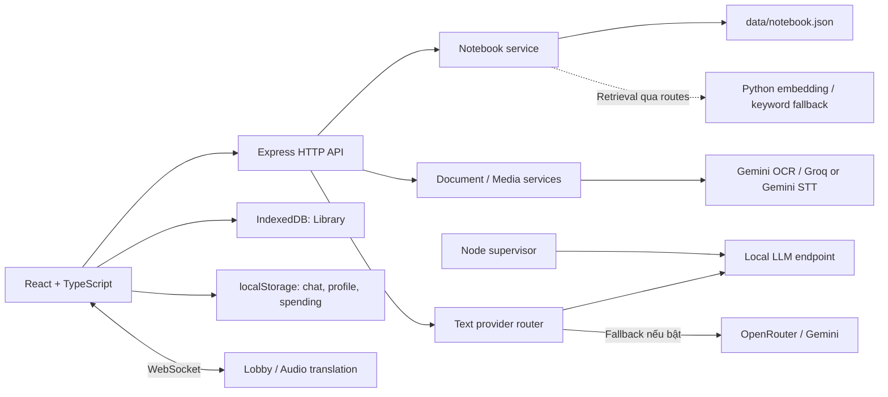

# Kiến trúc WorkNote

Đối chiếu mã nguồn ngày **03/10/2026**. Đây là kiến trúc bản phát triển hiện có, không phải thiết kế triển khai nhiều người dùng đã nghiệm thu.

## Tổng thể

Express phục vụ Vite middleware ở development và `dist/` khi `NODE_ENV=production`. API và frontend dùng cùng origin. Python là worker/endpoint phụ trợ; frontend không gọi trực tiếp model hoặc giữ khóa cloud.

## Các luồng chính

### Library: file → nội dung → kết quả học tập

1. `useDocumentUpload` và API client gửi file qua multipart.
2. `routes/processFile.ts` nhận file qua Multer; controller chuyển sang `processFileService`.
3. `documentService` trích xuất các định dạng văn bản được hỗ trợ. Media đi qua `audioService`; nội dung cần vision sử dụng Gemini.
4. `llmOrchestrator` phân tích nội dung và chuẩn hóa summary, quiz, mindmap; pipeline có bước mask/unmask PII cho văn bản ở những nhánh đã tích hợp.
5. `useFileManager` giữ trạng thái UI và lưu tài liệu/kết quả vào IndexedDB.

Multer disk storage giảm việc giữ upload ngay trong JSON; các bước đọc file, chuyển buffer và gọi provider vẫn có thể dùng nhiều RAM. Chưa có benchmark để khẳng định xử lý file lớn an toàn ở mọi route.

### Notebook: nguồn → đính kèm → hỏi đáp

1. `NotebookWorkspace` tạo notebook; `NotebookSourcePanel` upload hoặc thêm URL.
2. Nguồn được lưu riêng. `sourceIds` quyết định nguồn nào thuộc ngữ cảnh của notebook.
3. `/api/notebook/chat` dựng ngữ cảnh, lấy snippets liên quan và gọi `routeTextTask("CHAT", ...)`.
4. Response trả `reply`, `provider`, `model`, `snippets`; giao diện hiển thị câu trả lời và nhãn provider.
5. Pages/sources lưu tại `data/notebook.json`; lịch sử hội thoại lưu ở trình duyệt theo notebook, tối đa 50 tin trong mã hiện tại.

Retrieval có Python embedding và fallback theo từ khóa. Phiên chạy hiện tại thiếu `torch` ở worker nên không được xem là xác nhận neural semantic search đã hoạt động. Có snippets không bảo đảm mọi câu AI sinh ra đều đúng hoặc được nguồn hỗ trợ.

### Mind Maps và Quiz

`MindMapWorkspace` chọn nguồn từ Library hoặc NotebookLM. Backend có service chia nhỏ nội dung, tổng hợp cây và lưu kết quả cho notebook. Quiz trong `EduGamePlayground` lấy từ `activeFile.quiz`; khi không có quiz sẽ dùng câu hỏi mặc định. Câu hỏi tạo trong hội thoại notebook chưa tự chuyển thành bộ quiz của game.

## Routing AI và ranh giới dữ liệu

| Tác vụ trong `providerRouter.ts` | Thứ tự |
| --- | --- |
| `CHAT`, `TEXT_SUMMARY`, `QUIZ` | Local → OpenRouter → Gemini; chỉ local khi tắt cloud fallback |
| `TRANSLATION` | Gemini → OpenRouter |
| `VISION` | Gemini |
| STT media | `audioService` ưu tiên Groq khi phù hợp, dự phòng Gemini |

Bảng mô tả các đường xử lý tương ứng, không áp đặt routing này lên mọi API cũ. Tutor ưu tiên endpoint local và có worker Python dự phòng; TTS, process-link và các nhánh media cần được xem riêng.

`localLlmSupervisor` kiểm tra `/v1/models` và tự khởi động `local_llm_server.py` khi cần. GGUF mặc định là Qwen2.5-1.5B Instruct Q4_K_M; runtime CPU. Dùng chung endpoint giảm nhu cầu nạp model riêng cho từng module, nhưng Tutor vẫn có đường worker fallback.

`ALLOW_CLOUD_LLM_FALLBACK=false` không chặn toàn bộ mạng. Tài liệu upload chứa ảnh/âm thanh hoặc tính năng dịch/đọc vẫn có thể đi qua dịch vụ ngoài. PII guard là bộ quy tắc nhận dạng, không bảo đảm phát hiện hết tên, số hoặc thông tin trong file nhị phân.

## Lưu trữ và đánh đổi

| Dữ liệu | Nơi lưu hiện tại | Đánh đổi |
| --- | --- | --- |
| File/kết quả Library | IndexedDB `worknote-db`, store `files` | Dễ demo, hỗ trợ Blob; phụ thuộc thiết bị và origin |
| Pages/sources/mindmap Notebook | `data/notebook.json` | Đơn giản; chưa có transaction, user ownership hoặc cơ chế nhiều instance |
| Chat notebook | localStorage `worknote_chat_<id>` | Không đồng bộ nhiều thiết bị |
| Profile, giao dịch, mục tiêu tiết kiệm | localStorage | Hồ sơ không phải phiên đăng nhập; xóa site data sẽ mất dữ liệu |
| File tạm | `uploads/` | Cần kiểm tra cleanup cho từng đường success/error |
| Quota, limiter, lobby | Bộ nhớ tiến trình | Chưa đồng bộ giữa nhiều process |

Có file khởi tạo Firebase client, nhưng không đủ để coi auth và đồng bộ dữ liệu đã hoàn thiện. Không khuyến nghị PM2 cluster với JSON store và state hiện tại.

## Điểm vào mã nguồn

| Phần | File |
| --- | --- |
| UI và navigation | [App.tsx](../src/App.tsx), [constants](../src/constants/index.ts) |
| Notebook UI | [NotebookWorkspace](../src/components/NotebookWorkspace.tsx), [SourcePanel](../src/components/NotebookSourcePanel.tsx) |
| HTTP / WebSocket bootstrap | [server.ts](../server.ts) |
| Upload | [route](../server/routes/processFile.ts), [service](../server/services/processFileService.ts) |
| AI routing | [providerRouter](../server/services/providerRouter.ts), [orchestrator](../server/services/llmOrchestrator.ts) |
| Local runtime | [supervisor](../server/services/localLlmSupervisor.ts), [Python server](../server/python/local_llm_server.py) |
| Notebook store và retrieval | [store](../server/services/notebookService.ts), [embedding](../server/services/embedService.ts), [sidecar](../server/services/sidecarService.ts) |
| Mindmap | [generation service](../server/services/mindMapGenerationService.ts) |
| PII | [piiGuardService](../server/services/piiGuardService.ts) |
| CI | [ci.yml](../.github/workflows/ci.yml) |

## Các quyết định cần hoàn thiện

Tách kiểm thử thuần khỏi integration model; thống nhất package manager và runtime; hợp nhất upload contract; bổ sung quyền sở hữu dữ liệu trước demo công khai; đo chất lượng AI và tải thực tế trước tuyên bố về độ chính xác, độ trễ hoặc tiết kiệm chi phí. Tiêu chí cụ thể nằm trong [roadmap](future_roadmap.md).
