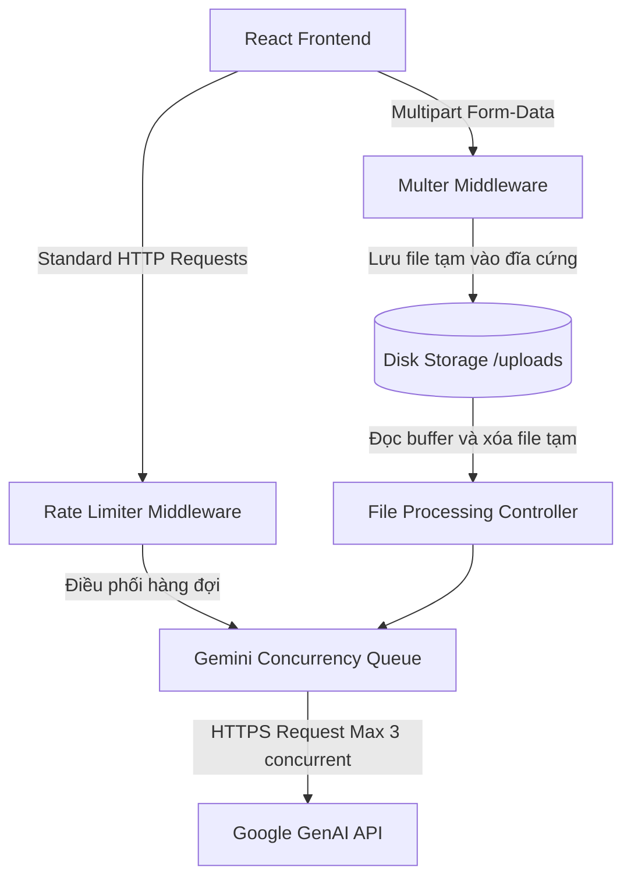

# 📄 TÀI LIỆU YÊU CẦU SẢN PHẨM (PRODUCT REQUIREMENT DOCUMENT - PRD)
## Dự án: VietLearn AI Lab — Nền tảng Ôn tập 2D RPG, Sơ đồ tư duy & Lab Âm thanh Đa ngữ

| Thông tin tài liệu | Mô tả |
| --- | --- |
| **Tên sản phẩm** | VietLearn AI Lab (v3.5) |
| **Trạng thái** | Đã tối ưu hóa hiệu năng & Đang phát triển tính năng |
| **Đối tượng độc giả** | Đội ngũ phát triển, Giảng viên, Nhà đầu tư, Người học |
| **Ngày cập nhật** | 15/06/2026 |

---

## 1. Tổng quan sản phẩm (Product Overview)

### 1.1. Bối cảnh (Background)
Học sinh, sinh viên ngày nay đối mặt với khối lượng tài liệu học thuật khổng lồ (PDF, giáo trình, bài giảng video/audio). Việc đọc hiểu, tóm tắt thủ công và tự đặt câu hỏi ôn tập tốn rất nhiều thời gian. Đồng thời, các phương pháp ôn tập truyền thống dễ gây nhàm chán và thiếu tính tương tác.

### 1.2. Giải pháp (Solution)
**VietLearn AI Lab** là một nền tảng học tập thông minh "Tất-cả-trong-một" (All-in-One). Ứng dụng ứng dụng trí tuệ nhân tạo (Gemini AI) để bóc tách tri thức từ đa phương tiện (tệp tin, liên kết), tự động chuyển hóa chúng thành các dạng học tập trực quan (Sơ đồ tư duy, câu hỏi ôn tập) kết hợp trò chơi hóa (Gamification qua game RPG 2D) và phòng nghiên cứu âm thanh (dịch live, luyện giọng 3 miền), giúp tối ưu hóa hiệu suất học tập.

### 1.3. Mục tiêu chiến lược (Product Goals)
- **Tăng tốc độ tiếp thu kiến thức**: Giảm thời gian đọc hiểu và tóm tắt tài liệu từ hàng giờ xuống còn dưới 1 phút.
- **Tăng tương tác học tập**: Áp dụng cơ chế Gamification giúp tăng 40% sự hứng thú học tập của sinh viên.
- **Tiện ích toàn diện**: Hỗ trợ đầy đủ các công cụ bổ trợ (Lab dịch âm thanh, sổ chi tiêu sinh viên) để giữ chân người dùng trong một hệ sinh thái duy nhất.

---

## 2. Chân dung người dùng (User Personas)

### Persona A: Nguyễn Văn Nam (Sinh viên CNTT)
- **Mục tiêu**: Cần học nhanh các giáo trình PDF chuyên ngành tiếng Anh để thi cuối kỳ.
- **Nỗi đau**: Tài liệu quá dài và khô khan, khó tự kiểm tra xem mình đã hiểu đúng chưa.
- **Cách dùng app**: Tải file PDF lên, đọc tóm tắt Tiếng Việt, xem Sơ đồ tư duy để nhớ ý chính và chơi game RPG 2D để giải đề ôn tập.

### Persona B: Trần Thị Mai (Học viên Ngoại ngữ)
- **Mục tiêu**: Luyện kỹ năng dịch thuật và làm quen với ngữ điệu, giọng phát âm Tiếng Việt các vùng miền.
- **Nỗi đau**: Khó khăn khi nghe giảng bài qua video tiếng Anh hoặc nghe các giọng địa phương đặc trưng.
- **Cách dùng app**: Sử dụng tính năng Ghi âm live để dịch bài giảng trực tiếp, dùng TTS phát âm thử giọng miền Bắc - Trung - Nam để nghe đối chiếu ngữ âm.

---

## 3. Yêu cầu chức năng (Functional Requirements)

Ứng dụng bao gồm 7 phân hệ cốt lõi. Dưới đây là mô tả chi tiết yêu cầu kỹ thuật của từng phân hệ:

### Module 1: Thư viện Tài liệu & Trích xuất Tri thức (OCR & Document Processing)
- **Yêu cầu**:
  - Người dùng có thể kéo thả hoặc chọn tải lên các tệp tin dạng: PDF, Hình ảnh (PNG/JPG), Âm thanh (MP3/WAV), Video (MP4) dung lượng tối đa 20MB.
  - Người dùng có thể nhập link URL trực tiếp (Google Drive, Dropbox, v.v.). Hệ thống tự động chuyển đổi định dạng tải trực tiếp.
  - Hệ thống sử dụng Gemini AI để phân tích tệp, bóc tách chữ (OCR), và trả về cấu trúc JSON chứa:
    - Bản tóm tắt học thuật bằng Markdown.
    - Sơ đồ tư duy phân tầng.
    - Bộ câu hỏi trắc nghiệm ôn tập (Quizzes).
  - Có thanh tiến trình (Progress Bar) hiển thị các trạng thái xử lý thực tế của AI.

### Module 2: Trợ lý AI hỏi đáp theo ngữ cảnh (Contextual AI Chatbot)
- **Yêu cầu**:
  - Chatbot tự động nạp ngữ cảnh từ nội dung tài liệu đang được chọn làm "Tài liệu hoạt động".
  - Trả lời thông thái bằng Tiếng Việt lịch sự, khoa học.
  - Nhận diện linh hoạt ý định người dùng kể cả khi gõ chat tự do hoặc không dấu.
  - Khi người dùng hỏi về phát âm/ngữ âm, chatbot tự động phân tích và đưa ra hướng dẫn phát âm chuẩn theo giọng miền Bắc, Trung, Nam.

### Module 3: Sơ đồ tư duy tương tác (Interactive Mindmap)
- **Yêu cầu**:
  - Hiển thị cấu trúc cây tư duy phân tầng từ kết quả đọc file.
  - Hỗ trợ đóng/mở (Collapse/Expand) các nút con để dễ theo dõi.
  - Cho phép người dùng chỉnh sửa nhãn của nút trực tiếp trên giao diện để cập nhật sơ đồ theo ý muốn và lưu lại trạng thái.

### Module 4: Đấu trường ôn tập 2D RPG (2D RPG Game & Quiz Playground)
- **Yêu cầu**:
  - Tích hợp một thế giới game 2D di động (Canvas-based). Nhân vật di chuyển bằng phím mũi tên hoặc nút bấm trên màn hình.
  - Khi va chạm với các chướng ngại vật/quái vật trên bản đồ, một hộp thoại câu hỏi trắc nghiệm (lấy từ bộ câu hỏi sinh ra của tài liệu) sẽ hiển thị.
  - Trả lời đúng giúp nhân vật vượt qua chướng ngại vật và tích lũy điểm thưởng. Trả lời sai nhân vật bị trừ máu/điểm và hiển thị lời giải chi tiết.

### Module 5: Lab Âm thanh & Dịch live (Audio Speech Lab)
- **Yêu cầu**:
  - **Text-to-Speech (TTS)**: Nhập văn bản bất kỳ, chọn giọng đọc vùng miền (Bắc - Trung - Nam). Hệ thống sử dụng mô hình giọng nói chuyên sâu của Gemini để xuất file âm thanh Base64 và phát lại trên trình duyệt.
  - **Live Translation**: Thu âm trực tiếp qua Microphone của thiết bị. Cứ mỗi chu kỳ 6 giây, hệ thống tự động bóc tách giọng nói thành văn bản gốc và dịch tức thì sang ngôn ngữ mục tiêu (Tiếng Việt/Anh/Nhật/Trung/Hàn).

### Module 6: Thư viện kiến thức công nghệ (Technical Knowledge Base)
- **Yêu cầu**:
  - Cung cấp sẵn tài liệu ôn tập tĩnh của 8 chuyên đề công nghệ chính (Đa nền tảng, Universal Link, QR Scanning, v.v.).
  - Học sinh có thể nhấn vào từng chuyên đề để xem lý thuyết và sơ đồ mô hình hóa quy trình.

### Module 7: Sổ chi tiêu và Quỹ tiết kiệm (Student Budget Tracker)
- **Yêu cầu**:
  - Công cụ quản lý tài chính độc lập giúp sinh viên ghi chép các khoản chi tiêu học tập, sinh hoạt.
  - Thiết lập mục tiêu tiết kiệm và tính toán dự phòng tài chính trực quan bằng biểu đồ trực quan (Recharts).

---

## 4. Yêu cầu phi chức năng (Non-Functional Requirements)

### 4.1. Hiệu năng & Khả năng chịu tải (Performance & Concurrency)
- **Thời gian phản hồi (Latency)**: API xử lý file và dịch thuật phải phản hồi dưới 10 giây trong điều kiện tải trung bình.
- **Tối ưu hóa Event Loop Node.js**: Không sử dụng tác vụ parse Base64 JSON đồng bộ cho các tệp tin lớn. Mọi tác vụ upload file bắt buộc đi qua stream nhị phân (Multer disk storage).
- **Concurrency Control**: Backend chỉ cho phép tối đa 3 tiến trình gọi Gemini API hoạt động song song để chống nghẽn và sập quota API (HTTP 429). Các tác vụ vượt quá sẽ tự động xếp vào hàng đợi chờ xử lý.
- **Mức độ ngốn RAM**: RAM máy chủ không được tăng đột biến quá 200MB cho mỗi tiến trình xử lý tệp tin.

### 4.2. Bảo mật (Security)
- **Ẩn dấu API Key**: Khóa `GEMINI_API_KEY` chỉ được lưu ở file môi trường `.env` phía backend, không được lộ ra client hoặc lưu trữ trong LocalStorage của trình duyệt.
- **Giới hạn tấn công (Rate Limiting)**:
  - Giới hạn tối đa 150 request/phút đối với các API thông thường để tránh tấn công từ chối dịch vụ (DDoS).
  - Giới hạn 10 request/5 phút đối với các thao tác tải tệp nặng.
- **Giới hạn URL Outbound**:
  - Mọi yêu cầu tải file từ URL ngoại vi (`/api/process-link`) phải có cơ chế Abort Signal (Timeout tối đa 15 giây) và giới hạn dung lượng tải về nghiêm ngặt dưới 20MB.

### 4.3. Khả năng mở rộng (Scalability)
- Ứng dụng phải tương thích hoàn toàn với chế độ chạy đa nhân (Cluster Mode) của các bộ quản lý tiến trình như PM2 để tự động chia tải lên nhiều core CPU.

---

## 5. Kiến trúc kỹ thuật (Technical Architecture)

- **Frontend Technology Stack**: React 19, TypeScript, TailwindCSS v4, Lucide Icons, Framer Motion (hiệu ứng mượt mà), Recharts (biểu đồ tài chính), Canvas API (xử lý game 2D RPG).
- **Backend Technology Stack**: Express.js, TypeScript (tsx), Multer, Express-rate-limit, Google GenAI Node SDK.

---

## 6. Kế hoạch phát hành & Chỉ số đo lường (Release & Metrics)

### Chỉ số đo lường hiệu quả (KPIs)
- **Thời gian chết của máy chủ (Server Downtime)**: < 0.1% nhờ PM2 Cluster Mode và cơ chế tự động giải phóng RAM khi upload file.
- **Tỷ lệ lỗi API Gemini (Gemini API Error Rate)**: < 0.5% (Loại bỏ triệt để lỗi nghẽn hạn ngạch HTTP 429 nhờ bộ điều phối Concurrency Limiter).
- **Tốc độ tải trang (Page Load Time)**: < 2 giây cho lần tải đầu tiên (nhờ tối ưu hóa nén bundles qua Esbuild và Vite).
- **Tỷ lệ giữ chân người học (Retention Rate)**: Mục tiêu > 35% người dùng quay lại ôn tập bài học thông qua game RPG và chatbot mỗi tuần.
