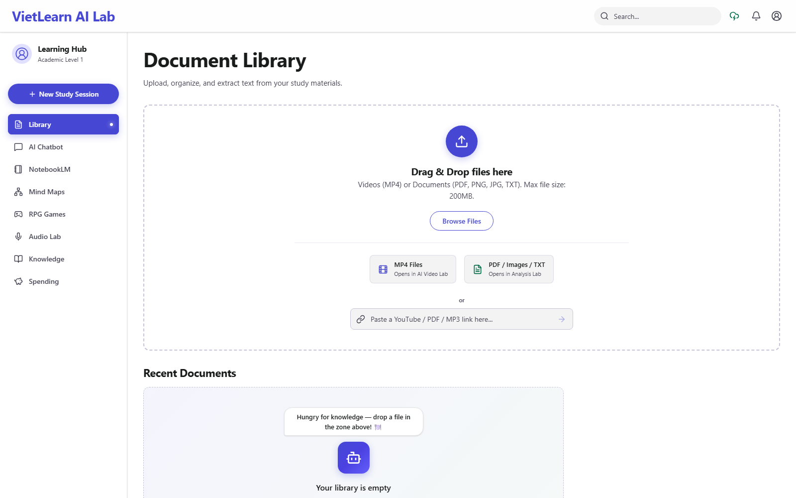
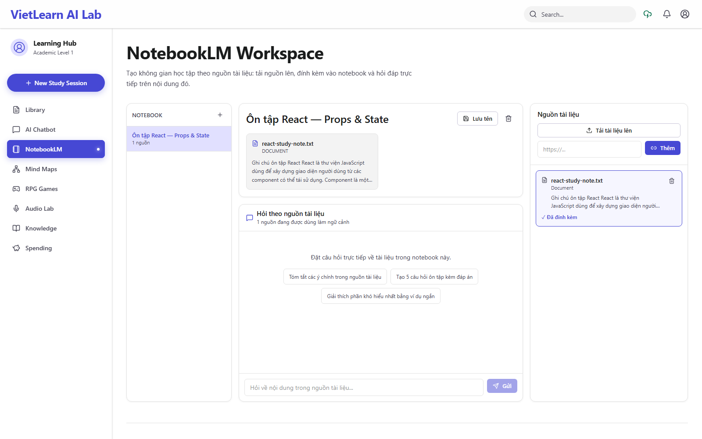
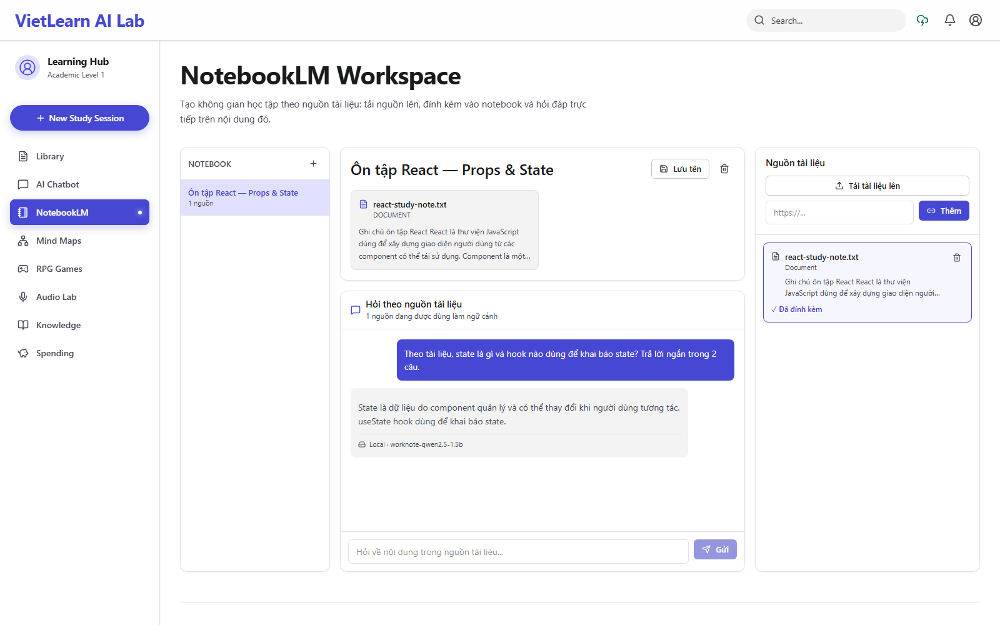
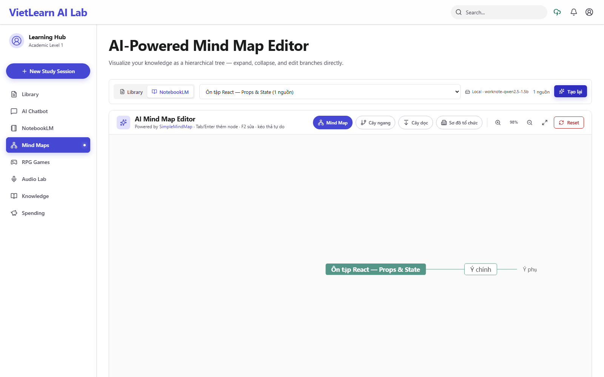
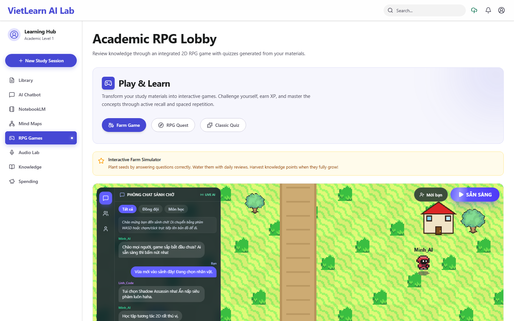
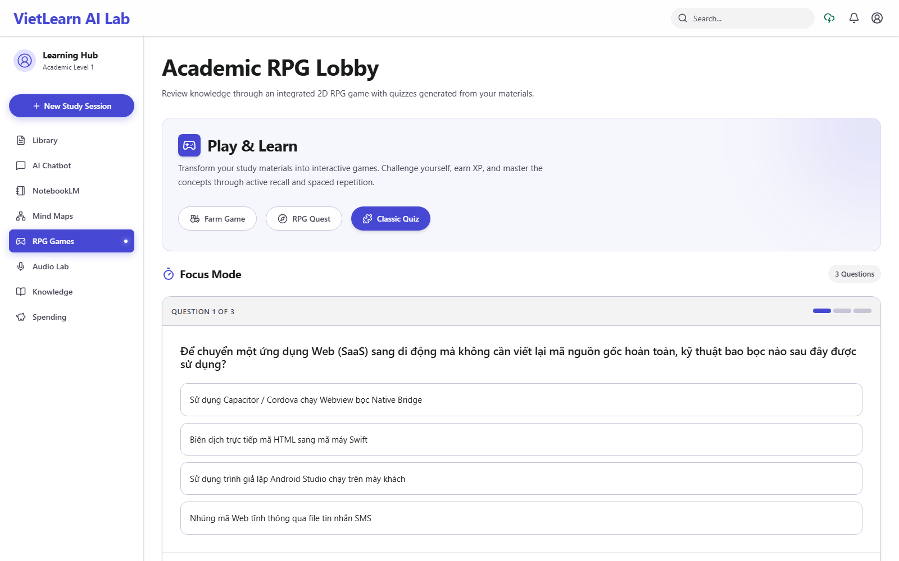
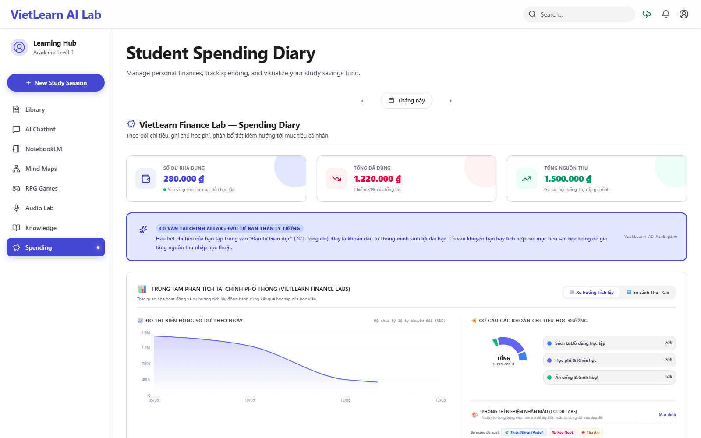

# Hướng dẫn sử dụng WorkNote

Ảnh chụp ngày **03/10/2026**, từ ứng dụng chạy local ở độ phân giải 1600 × 1000. Giao diện hiện dùng tên **VietLearn AI Lab**. Các nhãn thao tác bên dưới giữ nguyên theo UI để dễ tìm.

Trước khi bắt đầu, làm theo [hướng dẫn cài và chạy](../README.md#chạy-dự-án). Muốn có phản hồi thực tế như ảnh NotebookLM, cần local LLM hoạt động. Nếu chỉ chạy demo, câu trả lời là nội dung giả lập.

## 1. Làm quen với Library

Mở `http://localhost:3000`. Thanh bên trái chứa Library, AI Chatbot, NotebookLM, Mind Maps, RPG Games, Audio Lab, Knowledge và Spending.



- **Browse Files** hoặc kéo thả file để thêm tài liệu vào Library.
- Khi phân tích thành công, chọn tài liệu để xem phần **AI Summary & Document Analysis** và dùng tài liệu đó làm ngữ cảnh cho các tab liên quan.
- Bắt đầu bằng [react-study-note.txt](examples/react-study-note.txt), một file nhỏ không có thông tin cá nhân. Các định dạng khác phụ thuộc bộ trích xuất và provider tương ứng.

Ảnh trên minh họa màn hình nhập tài liệu, chưa phải bằng chứng pipeline Library đã phân tích mọi định dạng. Nhãn giới hạn file trên UI chưa đồng nhất với server; xem [các giới hạn đã ghi nhận](verification.md).

## 2. Tạo notebook và đính kèm nguồn

1. Chọn **NotebookLM** ở thanh bên.
2. Nhấn dấu **+** có tooltip **Tạo notebook** (hoặc nút cùng tên khi danh sách trống).
3. Đổi tên thành **Ôn tập React — Props & State**, nhấn **Lưu tên**.
4. Ở cột **Nguồn tài liệu**, nhấn **Tải tài liệu lên** và chọn [react-study-note.txt](examples/react-study-note.txt).
5. Nhấn **+ Đính kèm vào trang** trên thẻ nguồn. Kiểm tra nhãn đổi thành **✓ Đã đính kèm** và phần giữa hiện **1 nguồn**.



**Upload và đính kèm là hai bước riêng.** Một nguồn nằm trong danh sách chưa có nghĩa nó đã được dùng cho notebook đang chọn. Library và NotebookLM cũng chưa tự đồng bộ nguồn với nhau.

Ô `https://...` và nút **Thêm** dùng cho nguồn URL. Với link yêu cầu đăng nhập hoặc YouTube không có phụ đề, không nên mặc định rằng ứng dụng lấy được nội dung. Luồng URL chưa được kiểm chứng trong bộ ảnh này.

## 3. Hỏi nội dung tài liệu

Nhập vào ô **Hỏi về nội dung trong nguồn tài liệu...** rồi nhấn **Gửi** hoặc Enter:

> Theo tài liệu, state là gì và hook nào dùng để khai báo state? Trả lời ngắn trong 2 câu.



Trong phiên chụp, API trả `provider: local`, `model: worknote-qwen2.5-1.5b` và snippet từ file mẫu. Nhãn **Local · worknote-qwen2.5-1.5b** xuất hiện dưới phản hồi. Câu trả lời xác định state là dữ liệu component quản lý và `useState` là hook khai báo state.

Bạn cũng có thể dùng các gợi ý tóm tắt, tạo câu hỏi hoặc giải thích. Đây là yêu cầu gửi trong hội thoại; câu hỏi được AI viết ra ở đây **không tự trở thành bộ quiz của game**.

Nếu câu trả lời sai hoặc không bám nguồn, đối chiếu văn bản, kiểm tra nguồn đã gắn và thử câu hỏi cụ thể hơn. Model nhỏ có thể suy diễn sai; một phản hồi thành công không bảo đảm độ chính xác cho mọi câu hỏi.

## 4. Tạo sơ đồ tư duy

1. Chọn **Mind Maps** ở thanh bên.
2. Trong vùng nội dung, chọn **NotebookLM** (hoặc **Library** nếu muốn dùng file đã phân tích).
3. Chọn notebook có nguồn trong danh sách.
4. Nhấn **Tạo sơ đồ**. Nếu đã có cây hoặc editor khởi tạo cây mẫu, nút có thể hiện **Tạo lại**.
5. Kiểm tra nhãn provider. Editor có các kiểu bố cục, thêm node bằng Tab/Enter, sửa bằng F2 và kéo thả.



**Giới hạn được giữ nguyên trong ảnh:** API local trả cây có nhánh “Ý chính/Ý phụ”, chưa hệ thống hóa tốt nội dung React. Ảnh xác nhận luồng chọn nguồn → gọi AI → hiển thị cây, không phải kết quả đạt tiêu chí chất lượng kiến thức. Cần cải thiện prompt/validation và đo chất lượng; xem P0-05 và P1-07 trong [roadmap](future_roadmap.md).

## 5. Thử quiz và trò chơi

Mở **RPG Games**. Có ba mục **Farm Game**, **RPG Quest**, **Classic Quiz**.



Chọn **Classic Quiz**, chọn một đáp án, xem giải thích rồi chuyển câu tiếp theo.



Hai ảnh dùng giao diện và câu hỏi mẫu có sẵn, không phải quiz sinh từ notebook React. Để dùng quiz của tài liệu, phân tích file ở Library và chọn file có quiz trước khi mở game. Chưa kiểm chứng multiplayer, toàn bộ vòng chơi hoặc lưu tiến trình game trong phiên này.

## 6. Các tiện ích bổ sung

- **AI Chatbot:** chọn tài liệu Library làm ngữ cảnh rồi hỏi đáp; tách với hội thoại NotebookLM.
- **Knowledge:** xem các chuyên đề kiến thức có sẵn.
- **Audio Lab:** thử đọc văn bản hoặc dịch âm thanh sau khi cấu hình provider và cấp quyền microphone. Chưa có ảnh/kết quả kiểm chứng audio trong phiên này.
- **Spending:** giao diện giao dịch, biểu đồ và mục tiêu tiết kiệm. Ảnh dưới dùng dữ liệu mẫu mặc định của ứng dụng, không phải dữ liệu tài chính cá nhân.



## 7. Dữ liệu được lưu ở đâu?

| Nội dung | Vị trí |
| --- | --- |
| Tài liệu và kết quả Library | IndexedDB trong trình duyệt |
| Notebook, nguồn và mindmap notebook | `data/notebook.json` trên server |
| Chat notebook, profile, chi tiêu | localStorage trên trình duyệt |

Giữ nguyên origin và browser profile để mở lại dữ liệu client. Xóa site data hoặc dùng cửa sổ ẩn danh có thể làm mất/không thấy dữ liệu đó. Server hiện chưa phân quyền notebook theo tài khoản.

## 8. Tái tạo bộ ảnh

Script [capture-demo.mjs](capture-demo.mjs) thao tác bằng trình duyệt thật, dùng file mẫu, kiểm tra phản hồi chat/mindmap và chụp PNG. Không mock API hoặc chèn kết quả AI giả.

Ở thư mục gốc, với app và local model đang chạy:

```powershell
# Chỉ cần nếu máy chưa có Chromium cho Playwright:
npx playwright install chromium
node project_docs/capture-demo.mjs
```

Script yêu cầu **notebook store trống** để không đưa tên/nội dung riêng vào ảnh. Nếu đã có dữ liệu, dùng checkout demo riêng; không xóa dữ liệu để ép chạy script. Script dùng browser profile mới, tạo notebook/nguồn mẫu rồi xóa đúng các bản ghi nó tạo trong `finally`; file ảnh và [capture-report.json](screenshots/capture-report.json) được ghi lại. Dừng tiến trình đột ngột có thể để lại bản ghi mẫu.

Nếu dùng cổng khác, đặt `$env:WORKNOTE_DEMO_URL = "http://localhost:3002"` trước khi chạy. Chỉ dùng script trên app demo local; script có thao tác tạo/xóa dữ liệu và gọi AI. AI có thể trả nội dung khác giữa các lần chạy. `pass` chỉ nói về luồng kỹ thuật; `completed_with_page_errors` nghĩa là đã chụp xong nhưng có lỗi JavaScript. Phiên ảnh này có một lỗi SVG khi chuyển tab, được giữ nguyên trong report. Script không chấm chất lượng model.
